# レンタルカー　システム  

## 概要 
このプログラムはｃ＃を使用した上で、三つの部分に分かれ、開発されました。  

## wcfサービス層
マイクロソフトのｗｃｆフレームワークを運用し、webサービスを提供するサービス層。
データベースと各業務に対するAPIをサービスとしてき提供します。

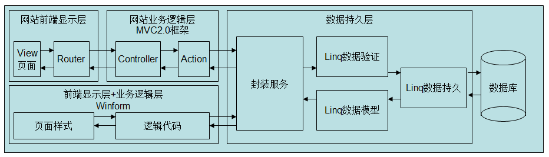  

その上に、クライアントは二つあります。  
### 会社内部管理端末（Winform使用）  

機能：登録、店舗人事管理、店舗自動車管理、オーダー処理、会社人事管理、資金管理など会社内部各管理機能を備えています。  
  
自動車管理画面  
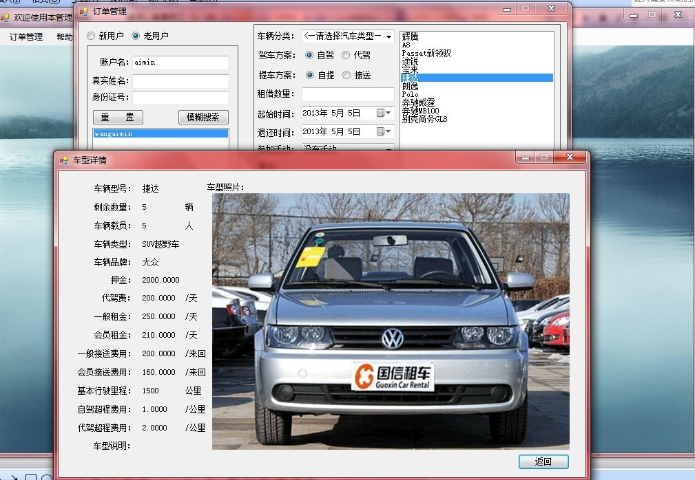  
オーダー処理画面  
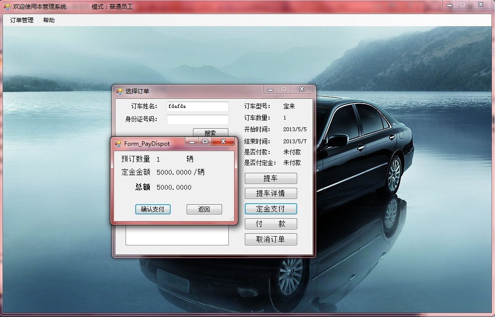  
オーダー処理画面  
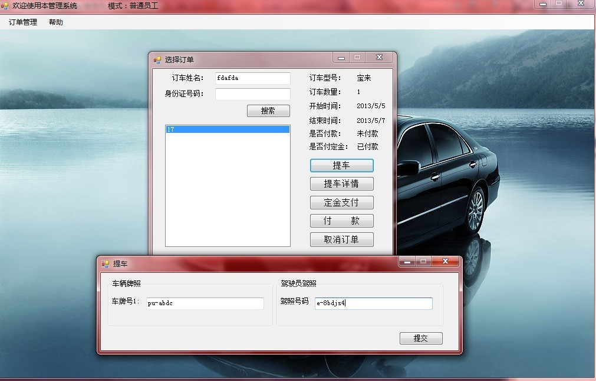  
オーダー処理画面  
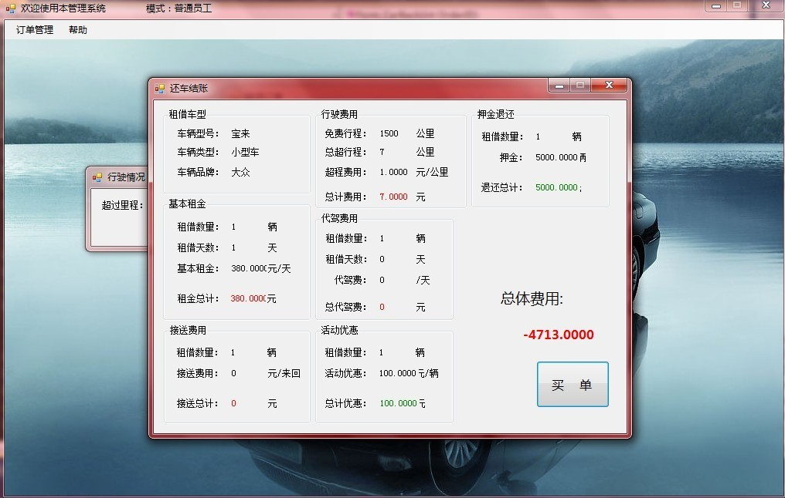  
社員出勤管理画面  
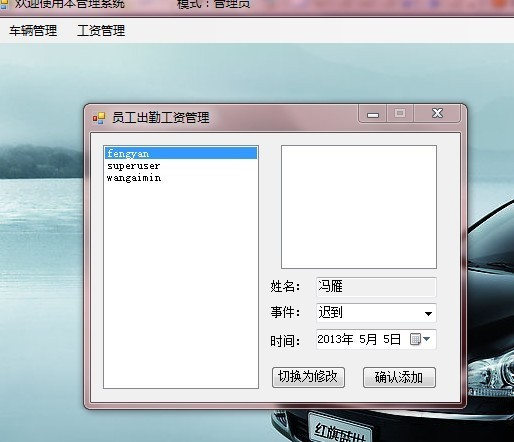  
資金管理画面  
  
ユーザー管理画面  
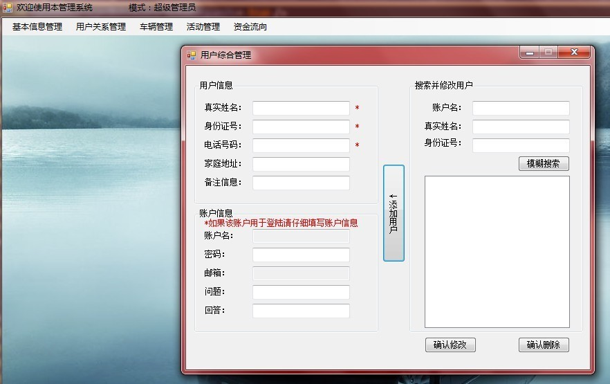  
店舗管理画面  
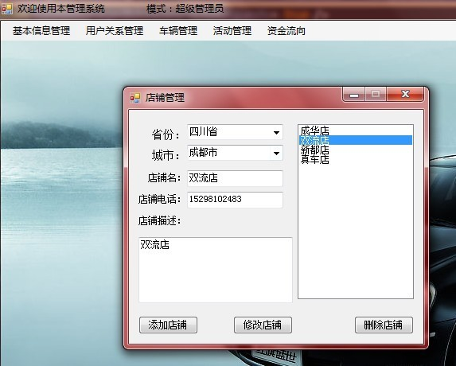  
権限管理画面  
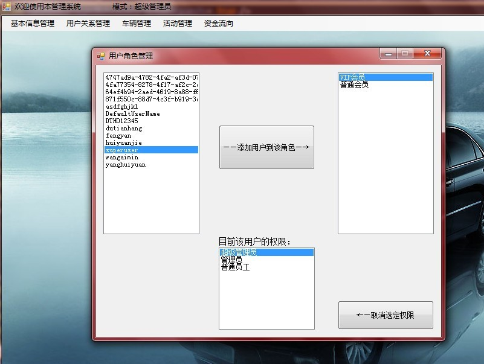  
社員配属画面  
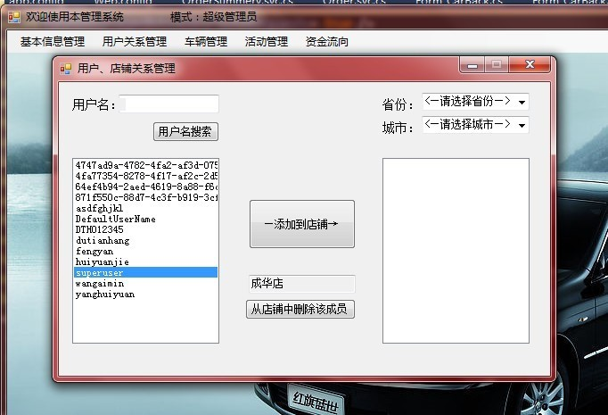  
車両管理画面  
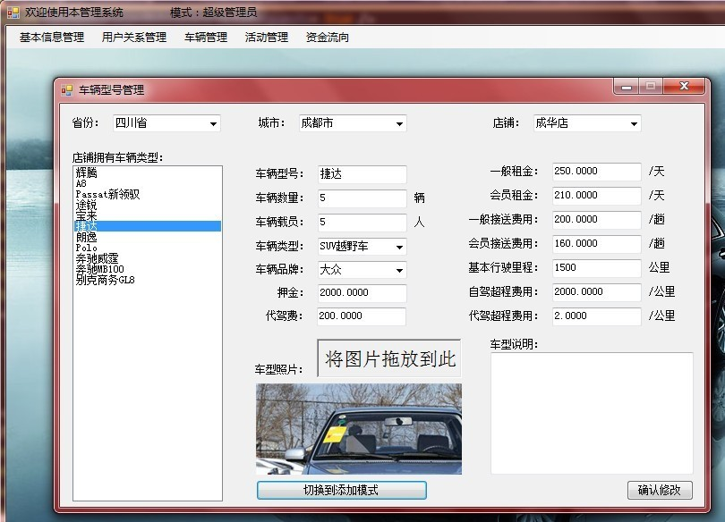  

### 顧客に自動車のレンタルサービスを提供するウェブサービス（マイクロソフト社MCV2.0フレームワーク）

機能：アカウント作成、登録、レンタルしたい自動車を探す、レンタル予約  
  
ウェイブ端トップページ  
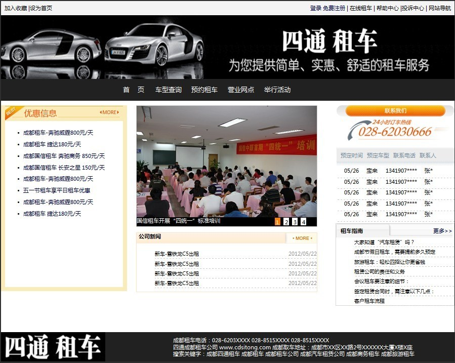  
自動車選択ページ  
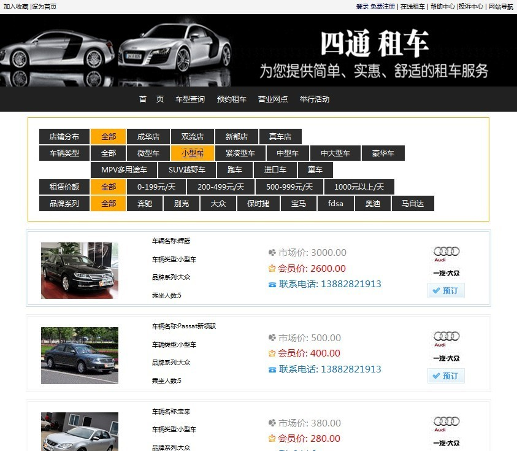  
自動車予約ページ  
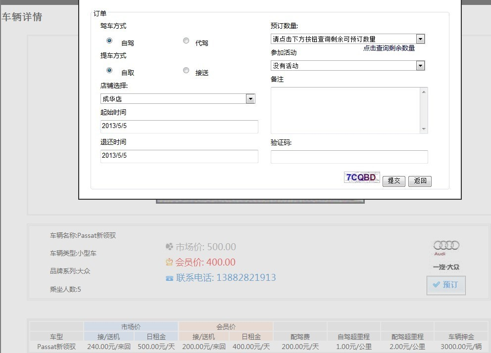  

